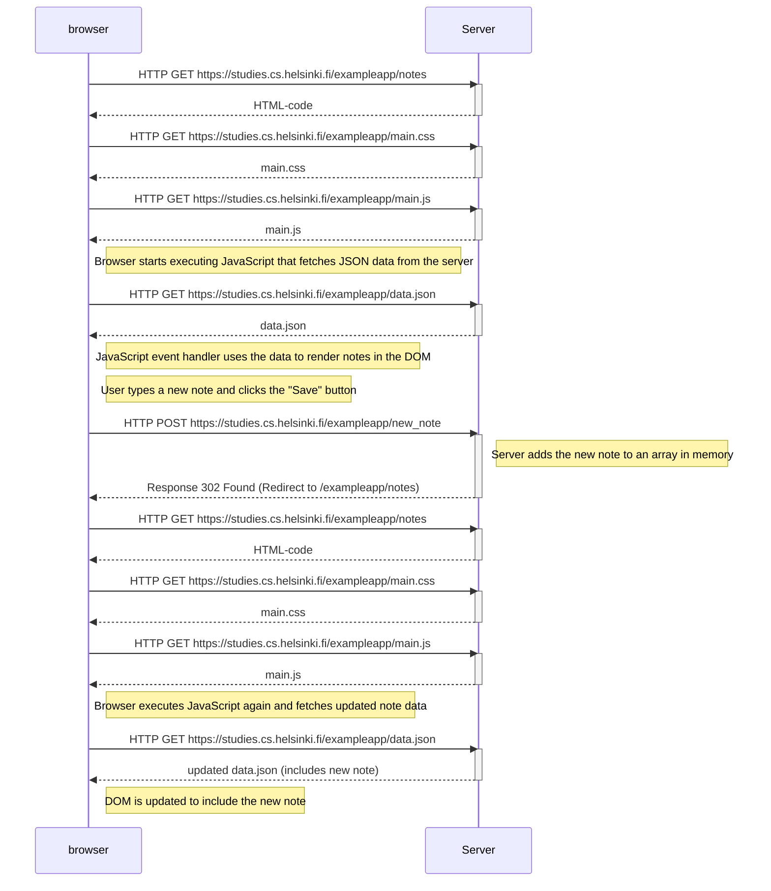

```mermaid
sequenceDiagram
    participant browser
    participant Server

    browser->>Server: HTTP GET https://studies.cs.helsinki.fi/exampleapp/notes
    activate Server
    Server-->>browser: HTML-code
    deactivate Server

    browser->>Server: HTTP GET https://studies.cs.helsinki.fi/exampleapp/main.css
    activate Server
    Server-->>browser: main.css
    deactivate Server

    browser->>Server: HTTP GET https://studies.cs.helsinki.fi/exampleapp/main.js
    activate Server
    Server-->>browser: main.js
    deactivate Server

    Note right of browser: Browser starts executing JavaScript that fetches JSON data from the server

    browser->>Server: HTTP GET https://studies.cs.helsinki.fi/exampleapp/data.json
    activate Server
    Server-->>browser: data.json
    deactivate Server

    Note right of browser: JavaScript event handler uses the data to render notes in the DOM

    Note right of browser: User types a new note and clicks the "Save" button

    browser->>Server: HTTP POST https://studies.cs.helsinki.fi/exampleapp/new_note
    activate Server
    Note right of Server: Server adds the new note to an array in memory
    Server-->>browser: Response 302 Found (Redirect to /exampleapp/notes)
    deactivate Server

    browser->>Server: HTTP GET https://studies.cs.helsinki.fi/exampleapp/notes
    activate Server
    Server-->>browser: HTML-code
    deactivate Server

    browser->>Server: HTTP GET https://studies.cs.helsinki.fi/exampleapp/main.css
    activate Server
    Server-->>browser: main.css
    deactivate Server

    browser->>Server: HTTP GET https://studies.cs.helsinki.fi/exampleapp/main.js
    activate Server
    Server-->>browser: main.js
    deactivate Server

    Note right of browser: Browser executes JavaScript again and fetches updated note data

    browser->>Server: HTTP GET https://studies.cs.helsinki.fi/exampleapp/data.json
    activate Server
    Server-->>browser: updated data.json (includes new note)
    deactivate Server

    Note right of browser: DOM is updated to include the new note
```